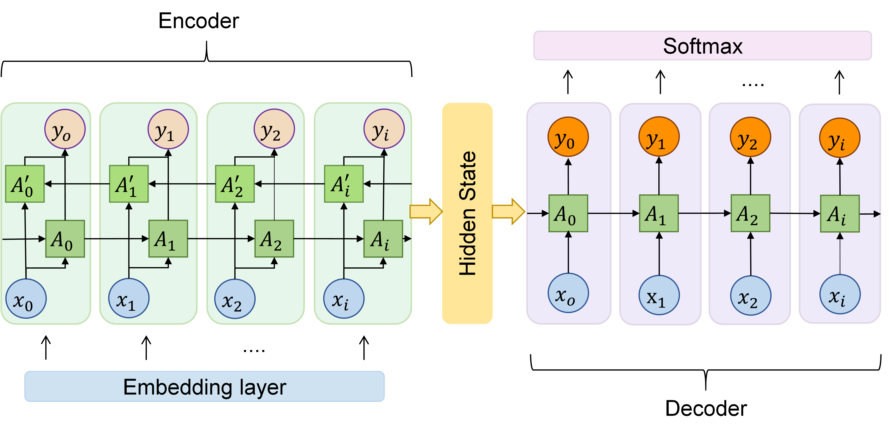

# BioSeq2vec
Learning representation of biological sequences using LSTM Encoder-Decoder
 

### Usage:

* Load pretrained models to distill deep representations of amino acids and nucleic acids sequences

  ```python
  from bioseq2vec import Seq2VecR2R

  BioSeq2vec_RNA = Seq2VecR2R()
  BioSeq2vec_protein = Seq2VecR2R()

  # char-level pretrained models
  BioSeq2vec_RNA.load_model("pretrained models/seq2vec_rna.model")
  BioSeq2vec_protein.load_model("pretrained models/seq2vec_protein.model")

  # or word-level pretrained models
  BioSeq2vec_RNA.load_model("pretrained models/seq2vec_rna_word.model")
  BioSeq2vec_protein.load_model("pretrained models/seq2vec_protein_word.model")

  # transform sequences
  bioseq2vec_RNA_feature = BioSeq2vec_RNA.transfrom(RNA_seqs)
  bioseq2vec_Protein_feature = BioSeq2vec_protein.transfrom(Protein_seqs)
  ```
* Plug-and-Play
  
  ```python
  from bioseq2vec import Seq2vecR2R

  BioSeq2vec = Seq2vecR2R(
     max_index=1000,
     max_length=100,
     latent_size=20,
     embedding_size=200,
     encoding_size=300,
     learning_rate=0.05
     )

  feature = BioSeq2vec.fit_transfrom(seqs)
  ```
* Pretraining
  
  ```python
  from bioseq2vec import Seq2VecR2R

  model = Seq2VecR2R(
     max_index=1000,
     max_length=100,
     latent_size=20,
     embedding_size=200,
     encoding_size=300,
     learning_rate=0.05
     )

  RNA_seq = [
     ['AUUCGACUCCAGGUAUUGC...CG'],
     ['UUAGCCGUUACGGCUAGGCU...G'],
     ['CUGAUAGGCUUAGGC......GCA'], 
     ......
  ]
  train_word = [
     ['AUUC', 'UUCG',.... 'UAGC', 'AGCG'],
     ['UUAG', 'UAGC',....,'GCAU', 'CAUG']
     ......
  ]
  train_char = [
     ['C', 'U', .... 'G', 'A'],
     ......
  ]

  model.fit(train_word)   # or train_char
  model.save_model('save model path')
  ```

### Requirements

```python
pip install -r requirements.txt
```
### Code to reproduce the results
```python
python main.py
```
### Citation
```
Yi HC., You ZH., Su XR., Huang DS., Guo ZH. (2020) A Unified Deep Biological Sequence Representation Learning with Pretrained Encoder-Decoder Model. In: Huang DS., Jo KH. (eds) Intelligent Computing Theories and Application. ICIC 2020. Lecture Notes in Computer Science, vol 12464. Springer, Cham. https://doi.org/10.1007/978-3-030-60802-6_30
```
Contact: haichengyi#gmail.com
